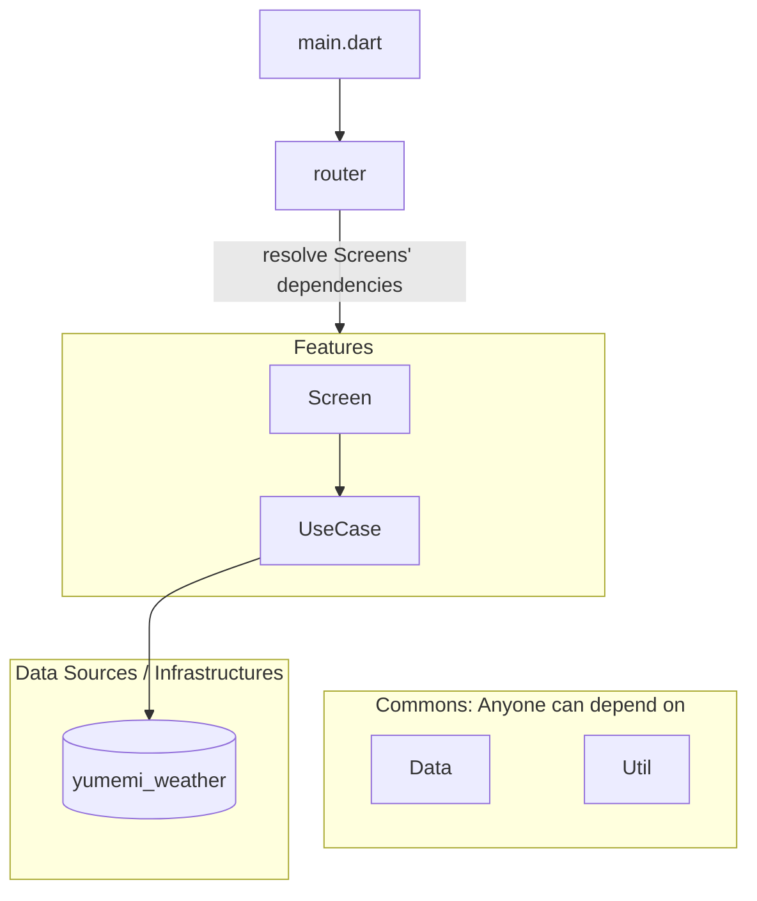

# アーキテクチャ

## 基本方針

- できる限りシンプルにする。不要なレイヤーは作らない。
- 抽象化は基本的に行わない。
  - Dart には暗黙的なインターフェイスが定義されて、インスタンスの差し替えも明示的な抽象化無しで行えるため。
  - [Classes | Dart](https://dart.dev/language/classes#implicit-interfaces)
- `router` が各画面 (Feature) の依存解決を行う。
  - 画面遷移の情報も外から注入可能にしておき `router` に閉じ込める。

## 定義されるレイヤーとレイヤー同士の依存関係

- `router`: 画面遷移、依存解決を行う。どこに依存しても良い。
- `Features`: 明示的な module ではないが、機能 (基本的には画面) のまとまり
  - `Screen`:  UI の責務を持つ `Widget`。
  - `UseCase`: UI から呼び出されるロジックを実装するもの。基本的には 1 Use Case 1 class であり、`call()` メソッドを提供する。
- `Data`: アプリケーションロジックを持たないモデルをまとめたモジュール。基本的には immutable にしておき `@freezed` で便利関数を拡張する。どこから依存されても良い。
- `Util`: 共通実装となるモジュール。どこから依存されても良い。

